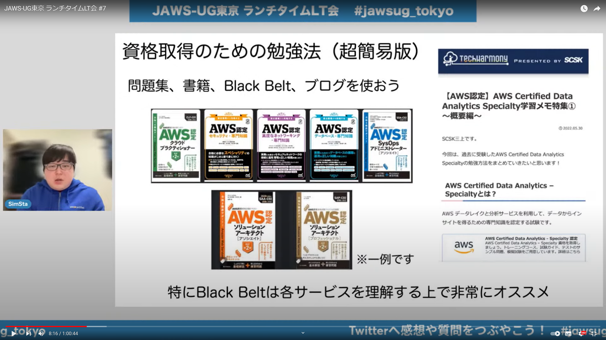

# AWS-Document
 > ## TODO : ハンズオン(Udemy, 公式) -> AWSの概要を知るために資格取得
 > テスト

# 初心者向けのAWSの学び方2024
https://speakerdeck.com/tttak/jin-karashi-meru-chu-xue-zhe-xiang-ke-aws-noxue-bifang-2024-0aa38397-f894-4ac3-a725-2b697395a750?slide=86

# AWSはじめの一歩と学びの勧め
https://speakerdeck.com/tttak/jaws-ugchu-xin-zhe-zhi-bu-awshazimefalse-bu-toxue-bifalsesusume?slide=121

# 【AWS初心者向け】AWS学習方法まとめ【15時間で達成できる】
https://qiita.com/toma_shohei/items/b7a001d26bd988d52021

# 【公式】AWS初心者向け資料
https://aws.amazon.com/jp/events/aws-event-resource/beginner/

# 【公式】AWSハンズオン資料
https://aws.amazon.com/jp/events/aws-event-resource/hands-on/

 > ## ***** ここまでが最優先 *****
 > ## 以下はSAMの使い方など

# [ハンズオン] 初心者でもAWS SAMでサーバレスアーキテクチャを学ぼう！簡単なWebの仕組みを作ってみよう！
<!-- # [ハンズオン] 初心者でもAWS SAMでサーバレスアーキテクチャを学ぼう:bangbang:簡単なWebの仕組みを作ってみよう:bangbang: -->
https://qiita.com/zwirky/items/789257e1be81bb1c44c6

# aws-sam-cliでLambda,DynamoDBのサーバーレスアプリケーション開発に入門してみる
https://qiita.com/umeneri/items/6fb3f7560f4a878f6dfd

# AWS SAMを使ってみる
https://qiita.com/spring_i/items/e087905a82c40cf900a0

# ゼロから始める AWS SAM 入門
https://qiita.com/OMOIKANESAN/items/b62fb62b8cd04544e1fc

# [AWS SAM]VSCodeでLambda関数をローカルで開発する
https://qiita.com/zukakosan/items/9c01aba5ff537382c856

# 【超初心者向け】WordPressをAmazon EC2インスタンスにインストールする
https://qiita.com/moomindani/items/9968df0d4396564bf74c

# AWSでWordPressを構築する
https://qiita.com/r_saiki/items/7eb008fb17d2cb9f96d5

# AWSコミュニティ
https://jawsug-bgnr.connpass.com/

# ソニーでの事例(プラットフォームエンジニア)
https://speakerdeck.com/shunsato123/sonidenoshi-li-karakao-erupuratutohuomukai-fa?slide=8